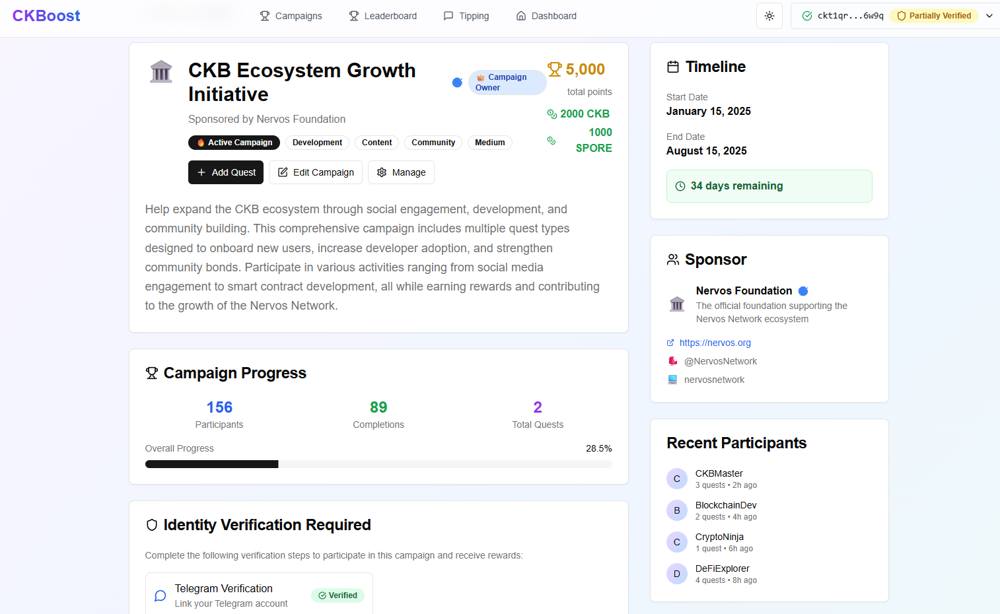

## **[DIS] CKBoost 游戏化社区参与平台提案**

## 摘要

本提案请求 CKB 社区基金 DAO 为 **CKBoost** 的设计、开发和部署提供资金支持，这是一个专为 CKB 生态系统构建的开源游戏化参与平台。

申请金额：$20,000 USD（按当前市价约合 xxx CKB）

项目开始时支付 10%，剩余 90% 分 3 个里程碑支付

预计完成时间：从开始后 3 个月

CKB 地址：ckb1qyqq5y2yu75h35shdke9gy4du9z536dvuruscqw90f

## 目的

⁠CKBoost 的使命，在于将当前分散、临时的社区贡献，转变为一个结构化、可衡量、且有明确回报的激励体系，以此来推动社区参与、激励真实贡献，并最终促进整个生态的健康发展。

摘自 Nervos Community Catalyst 公告帖：

该倡议专注于建立结构，使社区能够因参与更琐碎的任务而获得奖励，如分享内容、发表评论、在"参与证明"任务平台下参与活动。任务可以是特定活动的一部分，旨在解决特定的高时效性需求（如推广 X 帖子）或解决活跃度不足的领域（如回复 DAO 提案）。其他此类活动可能包括对链上或链相关活动的奖励（如向 DEX 存入流动性、铸造 iCKB 或 RUSD、运行 CKB 节点）。

排行榜将汇总活动和日常活动的积分，顶级参与者赚取 CKB 奖励，任何参与者都能随机获得小额奖励。

CKBoost 通过为任务、活动、可验证工作证明和链上奖励公平分配提供技术支撑，直接支持 Nervos Community Catalyst 倡议的目标。

## 为什么？

随着最近推出的倡议（如 Community Keeps Building）来激励内容创作者、新 CKB 构建者、活动家和先驱者，⁠社区现在终于有了一套相对正式和结构化的方法，来奖励那些有才华的贡献者。

但目前仍存在一些问题，例如：

* 如何让那些不具备特定技能，或无法投入大量时间的普通社区成员，也能通过贡献获得激励。
* 如何确保社区努力在社交媒体、链下和链上平台上协同作用，以产生更大影响并专注于共同目标
* 如何创造有趣且有激励的体验，为社区参与和发展创造热情
* 如何创造利用 CKB 并鼓励更多链上活动的体验

CKBoost 正是为了应对这些挑战而构思的。

## 谁？

我在 CKB 上积极开发已超过一年半，从设计Stable++和架构开始，编写了核心仓库中超过 95% 的代码（包括合约、测试、自动化脚本）以及部分后端服务和 DevOps。之后我加入了 CKB Eco Fund Dev Rel，开发了 CKB 的 Nest.js 自动交易框架、Pausable UDT 以及 SSRI 协议和 SDK 的实现和 WASM 实现。我还参与了 ccc molecule 模块、部署模块和各种不同的教程的开发，以及 Awesome CKB 这个AI友好的资源中心。

今年夏天，我改变了与 CKB 社区合作的合作模式和我的角色，开始以独立开发者的身份，致力于开发社区亟需的 dApp 和智能合约。

如前文所述，我将代表 Nervos Community Catalyst 完成这个项目。

## 设计原则

### 平台概览

**CKBoost** 将是一个开源网络平台，结合：

* **活动和任务管理：** 平台的管理员、社区的治理或领导角色成员，以及通过白名单认证的赞助者，都可以发起包含多个任务的激励活动，包含详细任务、成功指标和完全资助的 CKB 或 xUDT 奖励池。
* **链上积分和徽章：** 所有积分和成就都通过专用 UDT 在链上跟踪，确保透明的奖励机制。
* **游戏化：** 连击奖励、难度乘数、动态排行榜和徽章里程碑鼓励健康竞争和持续贡献。
* **验证和反 Sybil 措施：** 灵活的验证选项，从手动 Telegram 绑定，扩展到 DID/KYC。奖励保持锁定直到通过验证。
* **社区打赏和同行认可：** 成员可以为杰出贡献提议打赏，通过民主多重批准流程和自动化社区金库支付。
* **综合管理仪表板：** 为活动创建者、平台管理员和审核者提供工具，监控进度、审查提交并管理奖励分配。

### UI 设计草图

CKBoost v0 的预期设计前端草图可在此处查看：

[https://ckboost.netlify.app/](https://ckboost.netlify.app/)

### 技术设计

包含详细技术设计规范的 GitHub 仓库在此处可用：

[https://github.com/Alive24/CKBoost](https://github.com/Alive24/CKBoost)

摘要版本如下：

| 层级 | 详情 |
| ----- | ----- |
| **前端** | Next.js React 应用，移动优先，钱包集成（CCC），可重用组件库，实时任务跟踪。 |
| **智能合约** | 模块化 Type Scripts：`ckboost-protocol-type`（治理和铸造）、`ckboost-campaign-type`（活动逻辑）、`ckboost-campaign-lock`（资金安全金库）、`ckboost-user-type`（提交、验证和绑定逻辑）。 |
| **去中心化 API 服务** | 完全开源的任何人都可以托管的 Cloudflare Workers。优选由活动赞助商和社区托管。 |
| **数据存储** | 所有关键状态的 CKB Cell 数据，任何人都可以托管的 Neon 存储用于非关键数据（仅用于完成提交，无需永久存储），本地缓存用于性能和费用节省。 |
| **验证和绑定** | 多方法验证选项，从手动 Telegram 证明开始。计划 DID/KYC 集成。X、Discord、Reddit 绑定以帮助验证。 |
| **外部集成** | 用于任务验证的社交 API（如 X/Twitter）、用于验证的 Telegram Bot、用于链上证明验证的索引器服务。 |

通过这种设计，我正在探索一种构建dApp的新模式：所有后端服务都应以相当"无信任"的方式运行，使用开源的任何人都可以部署的代码库，并减少对任何单一集中式运营商的依赖。

这种架构从根本上重新定义了 dApp 与其基础设施之间的关系。CKBoost 不是作为单一的"后端"服务器（会成为单点故障或控制点），而是作为可互操作服务的弹性网络运行。核心逻辑固化在链上 CKB 合约中，而链下操作如数据索引和证明验证则由开源、去中心化且易于复制的工作器处理。任何人，从活动赞助商到社区成员，都可以部署这些服务，创造真正强大且抗审查的生态系统。

这种方法不仅增强了去中心化和安全性，还培养了更加参与和赋权的社区。通过提供开源的任何人都可以部署的基础设施，我们邀请社区不仅使用平台，还积极参与运行它。

### 核心用户流程

1. **活动基础流程**
   * 定义任务 → 资助活动 → 设置证明要求 → 获得管理员批准 → 启动 → 监控提交 → 分配奖励。

2. **活动赞助商流程**
   * 申请赞助商身份 → 定义任务 → 资助活动 → 设置证明要求 → 获得管理员批准 → 启动 → 监控提交 → 分配奖励。

3. **贡献者流程**
   * 连接钱包 → 浏览活动/任务 → 完成任务 → 提交证明 → 等待批准 → 通过验证 → 领取链上奖励 → 赚取徽章和排行榜排名。

4. **打赏提议流程**
   * 社区成员提议打赏 → 获得 5 个同行批准 → 从社区金库自动支付 → 用户资料永久记录。

5. **管理员流程**
   * 身份验证
   * 活动赞助商验证
   * 活动批准
   * 基础活动和排行榜活动创建

### **活动示例**

为了测试和演示系统，我们将部署常见活动的真实活动：

* **AMA 提升：** 为提问、分享 AMA 帖子和放大 Nervos 讨论获得积分。
* **知识提升：** 从知识库分享和总结文章。
* **链上任务：** 锁定 CKB 铸造 iCKB、在 UTXOswap 上添加流动性或与其他 Nervos DeFi 交互。
* **社区治理：** 参与提案、提供有意义的反馈或分享分析见解。

这些将展示 CKBoost 如何支持广泛的贡献类型：技术、内容、社交和治理相关。

### **风险管理**

**关键风险和缓解措施：**

* *Sybil 攻击*：锁定奖励 + 验证层 + 多方法证明。
* *智能合约漏洞*：合约金库中的小额初始资金，逐步推出，扩展前审计。
* *参与度低*：模拟活动，与现有社区领导合作，明确激励。
* *可扩展性*：优先使用 Cell 数据设计，配合缓存和批处理以实现高吞吐量。

## 路线图和里程碑

资金涵盖约 3 个月的专注交付，分为三个明确阶段。资助开始时收到初始 10% 的预付款：

---

**里程碑 1：基础和核心 MVP（约第 1 个月）- 支付 30% 资金**

* 部署带有 CCC 钱包集成的 Next.js 脚手架。
* 视觉和交互原型设计。
* 核心脚本的智能合约开发（`protocol-type`、`protocol-lock`、`campaign-type`、`campaign-lock`、`user-type`）。
* 启动协议 Cell 以管理白名单赞助商、管理员角色和积分 UDT 铸造。
* 构建活动和任务创建流程（仅手动审查证明）。
* 实现积分 UDT 和锁定奖励分配。

---

**里程碑 2：高级验证和游戏化（约第 2 个月）- 支付 30% 资金**

* 扩展验证方法：集成 Telegram 管理员审查，为后续准备 DID/KYC 集成。
* 设计简单的排行榜和用户资料，进行进度跟踪。
* 添加连击奖励、难度乘数和徽章里程碑功能。
* 开发带有多重签名批准的打赏系统。
* 改善用户资料：公共成就、贡献日志。
* 构建管理员仪表板，更好地管理提交和分析。

---

**里程碑 3：模拟活动和预扩展（约第 3 个月）- 支付 30% 资金**

* 在监督下部署真实测试活动（如 AMA 提升、链上提升）。
* 与真实用户测试奖励分配和验证流程。
* 研究自动化链上行动验证（如 iCKB 锁定的预言机）。
* 发布赞助商和贡献者的入门文档。
* 最终测试、错误修复和下一阶段提案的 DAO 报告。

---

### **成本明细**

成本按里程碑细分，反映 3 个月的全职开发者工作。

网站托管、域名、IPFS 存储的费用将由 Nervos Community Catalyst 承担。

### **结论**

CKBoost 为可持续的社区参与系统奠定了基础，任何项目、赞助商或贡献者都可以从中受益。该提案详细说明了其实施的设计、技术架构和分阶段路线图。该平台旨在为社区贡献提供结构化和透明的框架，利用链上机制进行奖励分配和认可。

该项目的核心是构建一个实用的开源工具，与 CKB 生态系统的去中心化理念保持一致。通过专注于模块化合约设计和Anyone-Can-Host的服务，该平台是为了弹性和未来可扩展性而构建的。

我将致力于在整个过程中提供透明的里程碑更新和社区反馈。欢迎大家在提出想法、问题和建议。

**感谢信任和支持！**
— *Alive24*