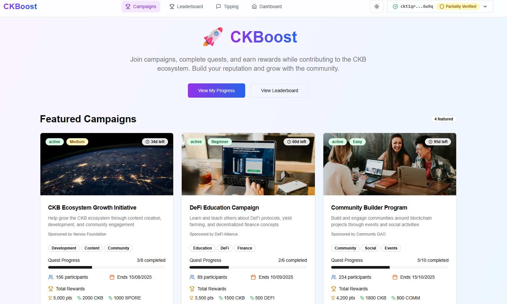
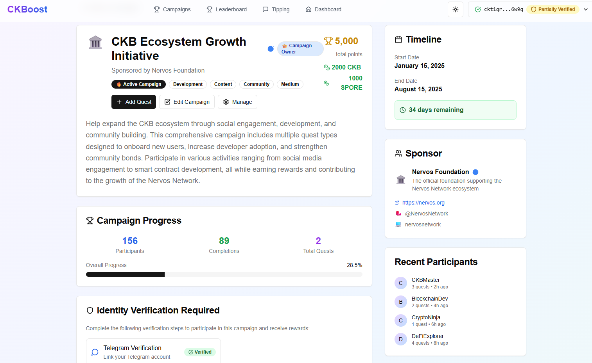
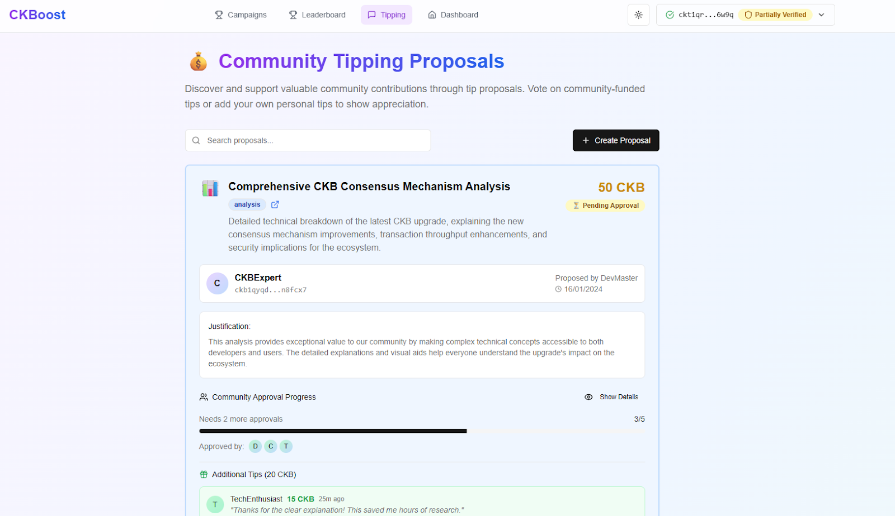
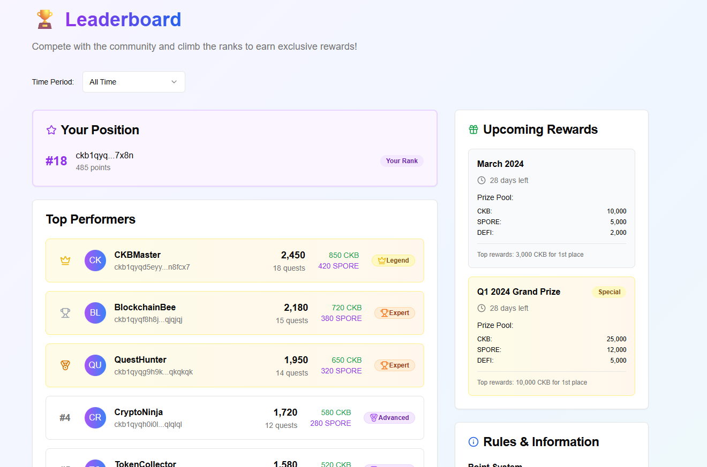

## **\[DIS\] CKBoost Gamified Community Engagement Platform Proposal**

## Summary

This proposal requests funding from the CKB Community Fund DAO to support the design, development, and deployment of **CKBoost**, a purpose-built open-source gamified engagement platform for the CKB ecosystem.

Amount requested: $20,000 USD (= xxx CKB @ current price)

10% paid at the time of grant commencement, with the remaining 90% split over 3 milestones

ETA to completion: 3 months from commencement

CKB address:ckb1qyqq5y2yu75h35shdke9gy4du9z536dvuruscqw90f

## Purpose

CKBoost’s mission is to transform community engagement from scattered, ad-hoc efforts into a structured, rewarding, and measurable system that drives participation, incentivizes real contributions, and encourages ecosystem growth.

From the Nervos Community Catalyst announcement thread:

This initiative focuses on setting up structures whereby the community can be rewarded for participating in more trivial tasks such as sharing content, posting comments, participating in campaigns under a “proof of participation” quest platform. Tasks can form part of specific campaigns aimed at addressing a specific time-sensitive need (e.g. raiding an X post) or addressing an area of low activity (e.g. reply to DAO proposals). Other such campaigns may include rewards for on-chain or chain-related activity (e.g. deposit liquidity to DEX, mint iCKB or RUSD, run a CKB node).

A leaderboard will aggregate points from campaigns and daily activities with top participants earning CKB rewards and small rewards issued randomly to any participant.

CKBoost directly supports the goals of the Nervos Community Catalyst initiative by providing the technical backbone for quests, campaigns, verifiable proof of work, and fair distribution of on-chain rewards.

### 

## Why?

With the recent launch of initiatives (such as Community Keeps Building) to incentivize content creators, new CKB builders, activists and pioneers, the community now has a way to reward talented individuals in a formalised and structured manner.

Some problems still remain unaddressed, such as:

* How to reward community members who either don’t have directly transferable skills for a formal track, or cannot commit the necessary time to participate on one  
* How to ensure that community effort is synergised for greater impact and focus on shared objectives across social media, off-chain and on-chain platforms.  
* How to create a fun and incentivized experience that creates enthusiasm for community participation and growth  
* How to create an experience that leverages CKB and encourages more on-chain activity

CKBoost has been conceived with these challenges in mind.

## Who? 

I’ve been actively building on CKB for more than one and a half years, starting from designing the product and architecture for Stable++, and authoring more than 95% of all code in the core repo (including contracts, tests, automation scripts) and part of the backend services and DevOps. I joined CKB Eco Fund Dev Rel afterwards and worked on Nest.js autotrade framework for CKB, Pausable UDT and implementation of SSRI protocol and SDK and the WASM implementation. I also worked on the ccc molecule module, deploy module, and a wide range of different tutorials, and the Awesome CKB AI friendly resource hub. 

This summer, I switched my role and pattern of collaboration with the CKB community, and started by working independently on building dApps and smart contracts highly needed in the community.

This project will be completed on behalf of the Nervos Community Catalyst, as linked to above.

## Design principles

### Platform Overview

**CKBoost** will be an open-source web platform combining:

* **Campaign & Quest Management:** Admins, community members with governance or leadership roles, or whitelisted sponsors can design multi-task campaigns with detailed quests, success metrics, and fully funded CKB or xUDT reward pools.  
* **On-chain Points & Badges:** All points and achievements are tracked on-chain via a dedicated UDT, ensuring transparent reward mechanisms.  
* **Gamification:** Streak bonuses, difficulty multipliers, dynamic leaderboards, and badge milestones encourage healthy competition and consistent contribution.

* **Verification & Anti-Sybil Measures:** Flexible verification options, starting with manual Telegram proof and expanding to DID/KYC. Rewards remain locked until verification is passed.  
* **Community Tipping & Peer Recognition:** Members can propose tips for exceptional contributions, with democratic multi-approval flow and automated treasury payouts.  
* **Comprehensive Admin Dashboards:** Tools for campaign creators, platform admins, and reviewers to monitor progress, review submissions, and manage reward distribution. 

### Draft UI design

A front-end draft of the intended design of CKBoost v0 can be seen here:

[https://ckboost.netlify.app/](https://ckboost.netlify.app/)

### 

### Technical design

The github repository which contains detailed technical design specifications is available here:

[https://github.com/Alive24/CKBoost](https://github.com/Alive24/CKBoost)

A summarized version is presented as follows:

| Layer | Details |
| ----- | ----- |
| **Frontend** | Next.js React app, mobile-first, wallet-integrated (CCC), reusable component library, real-time quest tracking. |
| **Smart Contracts** | Modular Type Scripts: `ckboost-protocol-type` (governance & minting), `ckboost-campaign-type` (campaign logic), `ckboost-campaign-lock` (secure vaults for funds), `ckboost-user-type` (submission, verification, and bindings logic). |
| **Decentralized API Service** | Fully open source anyone-can-host Cloudflare Workers. Preferably hosted by campaign sponsors and community. |
| **Data Storage** | CKB Cell data for all critical states, anyone-can-host Neon storage for non-critical data (only for the purpose of completion submission, no need to store permanently), local cache for performance and fee saving. |
| **Verification and Bindings** | Multi-method verification options, starting with manual Telegram proof. DID/KYC integration planned. X, Discord, Reddit bindings to help validation. |
| **External Integrations** | Social APIs for quest verification (e.g., X/Twitter), Telegram Bot for verification, indexer services for on-chain proof validation. |

With this design, I am implementing a new pattern of decentralization in building decentralized applications: all backend services should be run in a rather “trustless” manner with open source anyone-can-host codebase, and reduce the reliance on any single, centralized operator.

This architecture fundamentally redefines the relationship between a dApp and its infrastructure. Instead of a single "backend" server that becomes a central point of failure or control, CKBoost operates as a resilient network of interoperable services. The core logic is enshrined in on-chain CKB contracts, while off-chain operations like data indexing and proof validation are handled by open-source, decentralized, and easily replicable workers. Anyone, from campaign sponsors to community members, can host these services, creating a truly robust and censorship-resistant ecosystem.

This approach not only enhances decentralization and security but also fosters a more engaged and empowered community. By providing open-source, anyone-can-host infrastructure, we invite our community not just to use the platform, but to actively participate in running it.

### Core User Flows

1. **Campaign Base Flow**  
   * Define quests → fund campaign → set proof requirements → get admin a → launch → monitor submissions → distribute rewards.

2. **Campaign Sponsor Flow**

   * Apply for sponsor status → define quests → fund campaign → set proof requirements → get admin approval → launch → monitor submissions → distribute rewards.

3. **Contributor Flow**

   * Connect wallet → browse campaigns/quests → complete tasks → submit proof → wait for approval → pass verification → claim on-chain rewards → earn badges & leaderboard ranking.

4. **Tip Proposal Flow**

   * Community member proposes a tip → receives 5 peer approvals → automated payout from community treasury → permanent record on user profile.  
5. Admin Flow  
   * Identity verification  
   * Campaign Sponsor verification  
   * Campaign approval  
   * Base campaigns and leaderboard campaign creation

### **Campaign Examples**

To test & demo the system, we’ll deploy real campaigns for common activities:

* **AMA Boost:** Points for asking questions, sharing AMA posts, and amplifying Nervos discussions.

* **Knowledge Boost:** Share and summarize an article from the Knowledge Base.

* **On-Chain Quests:** Lock CKB to mint iCKB, add liquidity on UTXOswap, or interact with other Nervos DeFi primitives.

* **Community Governance:** Engage with proposals, provide meaningful feedback, or share analytics insights.

These will show how CKBoost supports a wide range of contribution types: technical, content-based, social, and governance-related.

### **Risk Management**

**Key Risks & Mitigations:**

* *Sybil Attacks*: Locked rewards \+ verification layer \+ multi-method proofs.

* *Smart Contract Bugs*: Small initial funds in contract vaults, gradual rollout, audit before scaling.

* *Low Participation*: Mock campaigns, partnerships with existing community leads, clear incentives.

* *Scalability*: Celldata-first design with caching and batch processing for high throughput.

## Roadmap & Milestones

The funding covers \~3 months of focused delivery across three clear phases. An initial 10% downpayment is received at the commencement of the grant:

---

 **Milestone 1: Foundation & Core MVP (\~Month 1\) \- 30% of grant paid**

* Deploy Next.js scaffold with CCC wallet integration.  
* Visual and interaction prototyping.

* Smart contract development for core Scripts (`protocol-type`, `protocol-lock`, `campaign-type`, `campaign-lock, user-type`).

* Launch Protocol Cell to manage whitelisted sponsors, admin roles, and Points UDT minting.

* Build campaign & quest creation flows (manual review only for proof).

* Implement Points UDT and locked reward distribution.

---

 **Milestone 2: Advanced Verification & Gamification (\~Month 2\) \- 30% of grant paid**

* Expand verification methods: integrate Telegram admin review, prepare DID/KYC hooks for later.  
* Design simple leaderboards and user profiles with progress tracking.

* Add streak bonuses, difficulty multipliers, and badge milestone features.

* Develop the tipping system with multi-signature peer approvals.

* Improve user profiles: public achievements, contribution logs.

* Build out admin dashboard for better submission management and analytics.

---

 **Milestone 3: Mock Campaigns & Pre-Scaling (\~Month 3\) \- 30% of grant paid**

* Deploy real test campaigns with oversight (e.g., AMA Boost, On-Chain Boost).

* Test reward distribution and verification flows with real users.

* Research automated on-chain action verification (e.g., oracles for iCKB locks).

* Publish onboarding docs for sponsors and contributors.

* Final testing, bug fixing, and DAO report for next-phase proposals.

---

### **Cost Breakdown**

The cost is broken down by milestone and reflects 3 months of full-time developer work.

Costs for webhosting, domain, IPFS storage will be covered by the Nervos Community Catalyst.

### **Conclusion**

CKBoost lays the foundation for a sustainable community engagement system that any project, sponsor, or contributor can benefit from. This proposal has detailed the design, technical architecture, and phased roadmap for its implementation. The platform aims to provide a structured and transparent framework for community contributions, leveraging on-chain mechanics for reward distribution and recognition.

The core of the project is to build a practical, open-source tool that aligns with the decentralized ethos of the CKB ecosystem. By focusing on a modular contract design and anyone-can-host services, the platform is built for resilience and future extensibility.

I’m fully committed to transparent milestone updates and community feedback throughout. I welcome everyone’s thoughts, questions, and suggestions below.

**Thank you for your trust and support\!**  
 — *Alive24*